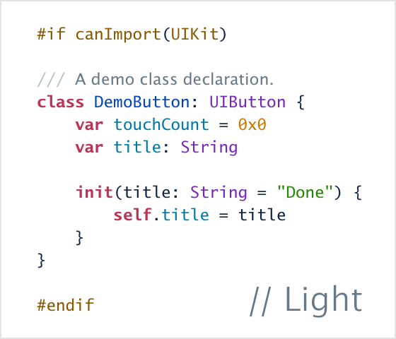
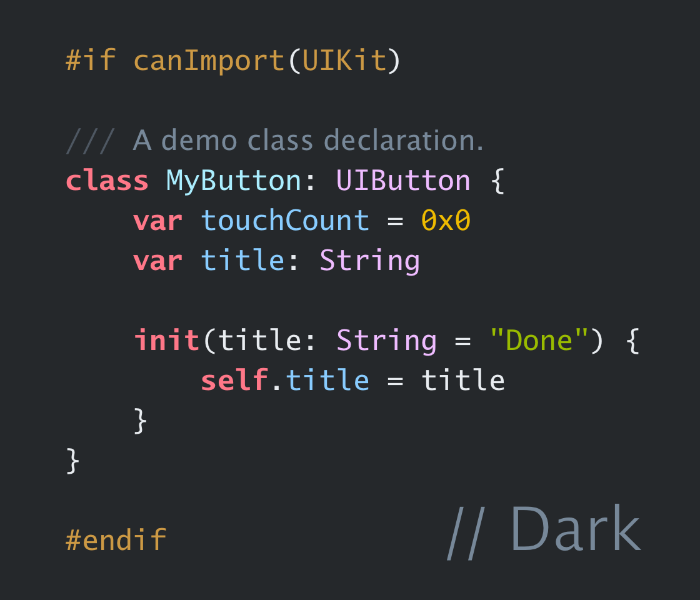

# Aqua

A quaint Xcode theme. 

This theme includes two variants for light and dark modes.

The recommended font is [Lucida Grande Mono](https://www.myfonts.com/collections/lucida-grande-mono-w1-g-font-monotype-imaging). Since it a copyrighted font, all font properties have been removed from the theme files. Alternatively, you may try Menlo and Monaco (though it lacks a bold style).

SF Mono might not be the best choice as its tone doesn't match the theme's essence. Aqua is designed to exude a quaint charm, hence the name.

You should definitely give this theme a try; it performs exceptionally well with real code. Its aesthetic appeal and practicality make it a standout choice for enhancing your coding experience. *Said ChatGPT.*
