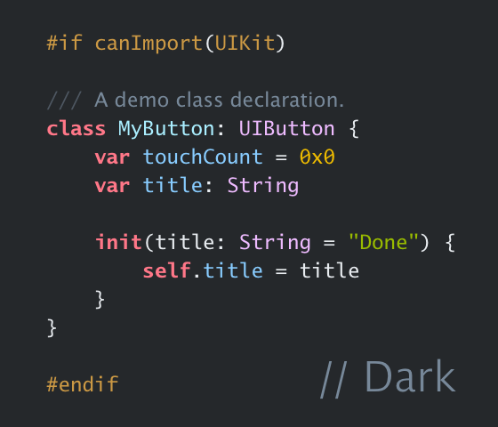

# Aqua

A quaint color theme for Xcode and Visual Studio Code.

This theme includes two variants: light and dark, and two versions: for Xcode and Visual Studio Code. *You should definitely give this theme a try; it works beautifully with real code and provides a visually pleasant experience*, said ChatGPT.

## Details

The Visual Studio Code version is modified based on the [GitHub Theme](https://marketplace.visualstudio.com/items?itemName=GitHub.github-vscode-theme), with the color of code tokens adjusted to match the Xcode version. It maintains the same syntax highlighting flavor as Xcode, that is, distinguishing between foreign (typically standard library) types, variables, etc., and project-specific (your code) ones. Foreign symbols are tinted purple, while project symbols are tinted cyan or blue.

This image shows the Visual Studio Code version in action, with a sample of TypeScript code:

*Note*: The Visual Studio Code version is tested with HTML, CSS, JavaScript/TypeScript, C/Objective-C, Python, and Markdown. It may render unexpectedly with other languages. Additionally, you may need to enable semantic highlighting in your settings to get the full experience.

## Fonts

The recommended font is [Lucida Grande Mono](https://www.myfonts.com/collections/lucida-grande-mono-w1-g-font-monotype-imaging). Since it is a copyrighted font, all font properties have been removed from the theme files. Alternatively, you may try Menlo and Monaco (though it lacks a bold style). SF Mono might not be the best choice as its style feels more modern than the theme's intended quaint charm.

## Installation

The version for Xcode is available in the directory `xc`:
-  To install, copy the two `.xccolortheme` files to `~/Library/Developer/Xcode/UserData/FontAndColorThemes`.

and the version for Visual Studio Code is in `vsc`:
-  To install, copy the contained directory to `~/.vscode/extensions`. This theme is not yet published on the Marketplace.

Both applications need relaunching to see the new theme in the list of available themes.

## License

You are free to use this theme (the code and the palette) for any purpose without any restrictions, except for the part that is based on the GitHub Theme, which you should refer to the original license for.

The demo images are typeset in Lucida Grande Mono, as mentioned earlier, and are for illustration only. The font is not included in this repository, and you should acquire it from the source mentioned above.

---

*Numbers are yellow; strings are green. Keywords are bold, and so are we. — Oh, no, that doesn’t rhyme.*
